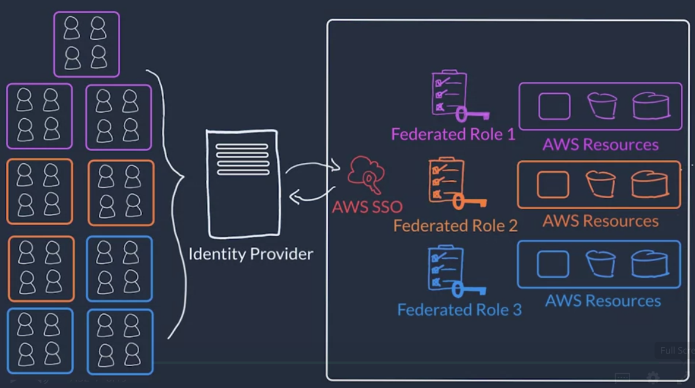

# Week 1

## Getting started

### Introduction to week 1

App will 

- be built in a VPC=Virtual Private Cloud 
- use EC2=elastic compute instances for compute
- store tabular data in RDS=Relational Database Service or alternatively in DynamoDB=Dynamic DataBase
- store image data in S3=simple storage service
- be monitored using CloudWatch
- be balanced using ELB=Elastic Load Balancer and EC2 Auto Scaling
- be secured using IAM=Identity Access Management

All of it will be setup using AWS Management Console.


### AWS global infrastructure

- Availability zone = Cluster of (high-speed-connected) data centers in same zone  (e.g. "us-east-1**a**")
- Region = Clusters of Availability zones (example: Northern Virginia "us-east-1", Frankfurt, Sao Paulo, ...)


How to choose a region for your app?

- Compliance = E.g. rule that data needs to stay within U.K.
- Latency =~ Closeness to user base
- Pricing = can vary due to tax structure
- Service availability = new services are not rolled out to all regions instantaneously

### Interacting with AWS

is possible through API calls using

- AWS Management Console (=webpage
  - simple, but can be tedious with repetitive setups
- AWS CLI = Command Line Interface
  - Example: `aws ec2 run-instances --image-id ami-07669`
  - recommended after a while, especially for repetitive setups
- AWS SDK = Software Development Kit
  - exists for e.g. python, java, ruby
  - Example: `boto3.client('ec2').describe_instances()`
  - provides a lot of power
  - (named boto, because boto dolphins swim and easily navigate in the amazon forest)

### Introduction to exercise 1

Setup AWS and alarm that daily total billing does not exceed 10 USD.


## Security in the AWS CLoud
### Shared responsibility model

- AWS is responsible for the security of the hardware and software (via virtualization)
- Customer is responsible for things like data access management, data encryption, firewalls, network traffic, etc. 


### Protect the AWS Root user

- single-factor authentification = only use password
- multi-factor authentification = use another factor such as App on mobile phone

Also: It is recommended that you do not use root user for "typical" administrative tasks. Very few actions require root privilege!

## AWS Identity and Access Management (IAM)
### Introduction

API calls (REST requests) must be both *signed* and *authenticated*. Amazon S3 REST API uses a [custom HTTP scheme based](https://docs.aws.amazon.com/AmazonS3/latest/userguide/RESTAuthentication.html) on a keyed-HMAC (Hash Message Authentication Code) for authentication. It ....

- concatenates the request elements to a string
- calculates the hash for the string using the AWS secret access key. This process is called "signing", the output hash string is called "signature".
- adds the hash to the request
- the receiving service uses the secret AWS claimed to have been used and also computes the signature. If the two signatures are identical, it "authentificates" the request, otherwise drops it.
- compares the two signatures (need to be exactly the same)

In the App, we need to setup credentials at three places

- credentials for AWS account to set everything up
- credentials between EC2 and S3 for reading and writing data
- credentials within EC2 for App - this is not done using IAM, but rather through an App-specific backend.


Beware of the difference between authentification and autherization:

- authentification = Are you the person you claim to be?
- autherization = Do you have the *permissions* for this action (=API call)?

IAM Policy looks like this:

```json
{
    "Statement": [{
        "Effect": "Allow",
        "Action": "ec2.RunInstances", # can also be a list of allowed actions
        "Resource": "resources for which action is allowed",
        "Condition": {
            # some optional conditions
        }
    }]
}
```

IAM policies can be attached to IAM users or IAM groups (groups should be preferred, since it can easily adjust for people changing job roles etc.).

Further recommendations: 

- setup MFA for root users (see above)
- **TODO**: create IAM user with administrative rights (as mentioned above, this should suffice for most tasks. Also IAM policies cannot be applied to root user.)
- use admin IAM users to create policies for everything else


### Setting up roles

For communication between EC2 and S3, do not setup a new IAM user. Rather use IAM *roles*!

IAM Policies can be assigned to IAM Identies = 

- IAM users
- IAM groups
- **IAM roles**

An IAM role

- is an identity, which can be assumed by someone / something who needs temporary access to AWS credentials (like access key and secret access key to sign requests)
  - maybe even by several things at once?
- has associated AWS credentials like IAM users. However, these credentials are...
  - programmatically acquired
  - temporary (between 15min - 36h)
  - automatically rotated
- does NOT have static login credentials like username, password
- are typically used for communication between AWS services

Best practices

- IAM roles are even stricter than users and groups, which is good!
- use an identity provider to manage users. This can be AWS SSO (Single Sign-On) or any third-party identity provider. You can then assign IAM roles to those identities. Also, the identity provider can be used across multiple AWS accounts!
- IAM *federated* roles can be used to easily give access to ~5000 users. AWS SSO (=Single Sign On) further simplifies this.



### Hosting the employee directory 

Video of setting up EC2 instance.


