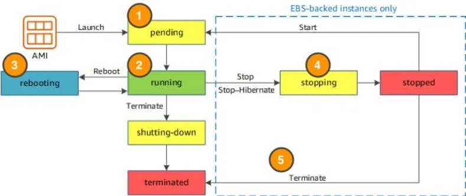

# Week 2

## AWS Compute
At a fundamental level, there are three types of compute options:

- virtual machines (EC2 = Elastic Compute Cloud)
- container services
- serverless

### EC2 (=Elastic Compute Cloud)

EC2 instances...

- are paid per seconds / hours
- are live instantiations of AMIs = Amazon Machine Images. 
  - AMIs contain
    - the OS
    - pre-installed applications
    - launch permissions
    - block device mapping (?)
  - AMIs are offered by...
    - AWS
    - AWS marketplace (community)
    - yourself based on existing EC2 instances
- "types" are grouped by purpose (e.g. compute optimized, memory optimized, etc.).
  - Example `c5.large` = `5`th generation of the `c`=generic computation *family* of `large` size.
  - instance type can be changed later on, too.

### EC2 Instance Lifecycle

EC2 instances...

- can be started and stopped manually (and automatically?)
- lose all their data upon termination !!!
  - there is a feature to prevent accidental termination and/or save data
- only cost something in the `running` and `stopping` state!
- exist in three pricing options:
  - on-demand instances = pay per time
  - reserved instances = fixed contract for 1-3 years - useful for 24/7 services (cheaper)
  - spot instances = set maximum hourly price and *maybe* get instance (up to 90% cheaper). Upon interruption, AWS warns you two minutes prior. Good for fault-tolerant workloads such as CI/CD, HPC, rendering, ...



### Exercise 3

Setup EC2 instance

### Container Services

AWS offers the following container orchestration services for starting, stopping, autoscaling, monitoring containers...

|                    | ECS = Elastic Container service | EKS = Elastic Kubernetes Service |
| ------------------ | ------------------------------- | -------------------------------- |
| Runtime            | AWS native technology           | Kubernetes                       |
| Container hostname | EC2 instance                    | "worker node"                    |
| Container name     | "task"                          | "pod"                            |


To run and manage your containers, you need to install the Amazon ECS Container Agent on your EC2 instances (they exist for both Linux and Windows AMIs). By default, ECS and EKS run on top of EC2 instances (see image below). In contrast, AWS *Fargate* offers serverless compute, see next section.


```yaml
# Example "task" or container definition in ECS
{
    "family": "webserver",
    "containerDefinitions": [ {
        "name": "web",
        "image": "nginx",
        "memory": "100",
        "cpu": "99"
    } ],
    "requiresCompatibilities": [ "FARGATE" ],
    "networkMode": "awsvpc",
    "memory": "512",
    "cpu": "256"
}
```

With ECS/EKS you can / are responsible for ...

- installing new software in containers
- setting up scaling
- architecting solution in a highly available manner (deployment across zones)

### AWS Fargate

AWS Fargate...

- is a serverless compute platform for either ECS or EKS
  - serverless = You cannot see the underlying host, in other words the host is *abstracted* for you.
- replaces the EC2 instances from before, which you cannot / need not configure anymore
- provides scaling and fault-tolerance

Serverless = You cannot see the underlying host, in other words the host is *abstracted* for you.


### AWS Lambda

AWS Lambda ...

- is setup by simply uploading the source code `code.zip` (I know that containers are also available)
- only runs when triggered, e.g. upon HTTP request, file upload or other events
- runs in an isolated environment, which is maintained by AWS. You get to choose: language of lambda function, CPU, memory, permission requirements, ... 
- supports runtimes of max. 15 min !!!
- suited for e.g. backend requests or report services
- is paid by 100ms intervals

Example: AWS Lambda function which...

- GIVEN the App of the whole tutorial
- WHEN an image file is uploaded to the S3 bucket
- THEN it resizes the image to a thumbnail
- and uploads the thumbnail back to the S3 bucket

During setup of the lambda function...

- it is also assigned the IAM role to access the S3.
- its handler is changed (?)


## AWS Networking

>  Note: The following is geared towards EC2 services, since in e.g. Lambda functions it is provided for you.

When setting up a VPC = Virtual Private Cloud you need to specify...

- the region (e.g. eu-central-1)
- the IP-range using CIDR notation, for example
  - `192.168.1.0/24` allows IP addresses from `192.168.1.0` to `192.168.1.255`, since first 24 bits are fixed.
  - `192.168.1.0/28` allows IP addresses from `192.168.1.0` to `192.168.1.16`, since first 28 bits are fixed.
  - `192.168.1.0/28` allows IP addresses from `192.168.1.0` to `192.168.255.255`, since first 16 bits are fixed.

The VPC can be further divided into subnets which can be opened/close separately and thereby provide more granular access. To create subnets, you need to specify...

- the parent VPC
- IP-range
- **the availability zone**

An IGW = Internet GateWay...

- connects your VPC to the Internet

A VGW = Virtual private GateWay...

- connects your VPC to on-premise data centers via an encrypted VPN connection


> Note: AWS reserves five IP-addresses for routers, DNS servers etc., namely x.x.x.0, x.x.x.1, x.x.x.2, x.x.x.3 and x.x.x.255.

### VPC Routing

While IGW supports access to the VPC, route tables guide path to "right room" (=right subnet)


Route tables are used to route (HTTP) requests

- FROM a subnet

- WITH a destination = IP-address of request
  - `0.0.0.0` = any IP-address
- TO a target = connection through which to send request
  - `local` = via local (proxy?) = targets in this VPC
  - `igw-id` = via Internet GateWay

By default, the main route table exists, which routes all requests with a destination inside the VPC to local targets. A custom route table was added which routes all requests with any (other) IP-address to the internet gateway. After creation, the custom route table is *associated* to both public subnets.


### Secure with VPC Security

There are two options (two kinds of firewalls):

|          | network ACL=Access Control List             | Security Group                                               |
| -------- | ------------------------------------------- | ------------------------------------------------------------ |
| controls | subnets                                     | EC2 instances                                                |
| state    | stateless = specify both inbound & outbound | stateful = specify only inbound and responses are automatically allowed temporarily |
| defaults | allows everything                           | blocks all inbound traffic, but allows outbound traffic      |

A common design pattern is organizing your resources into different groups and creating security groups for each to control network communication between them.


### Exercise 4

Setup VPC, subnets, IGW, route tables, EC2 instance