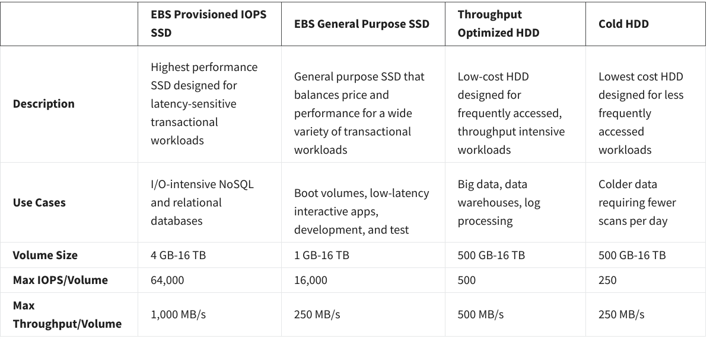
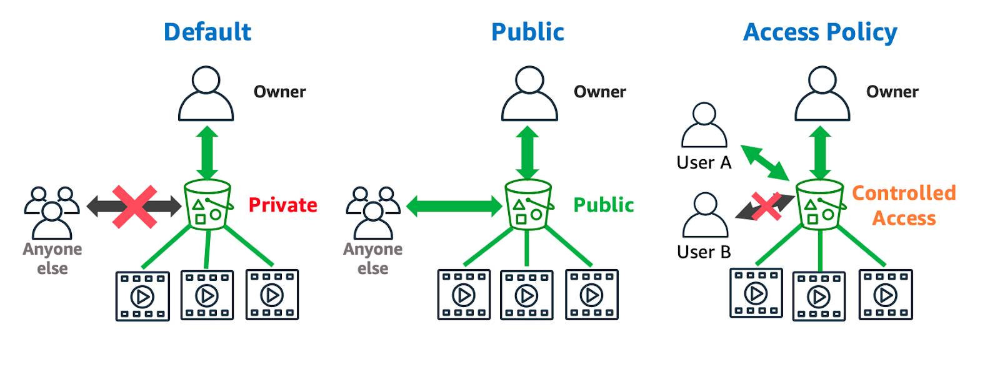
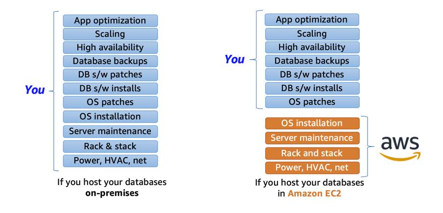
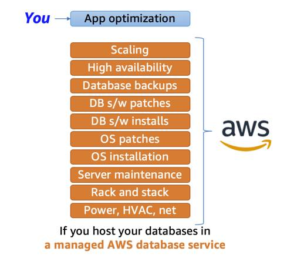

# Week 3

## Storage on AWS

Two main types

|                   | File storage                                                 | Block storage                                                | Object storage                                               |
| ----------------- | ------------------------------------------------------------ | ------------------------------------------------------------ | ------------------------------------------------------------ |
|                   | = your local filesystem                                      | = splits files into fixed-size blocks                        | = stores files in flat structure                             |
| AWS               | EFS = Elastic File System (not described further below)      | EBS = Elastic Block Storage                                  | S3 = Simple Storage Service                                  |
| ideal for         | centralized access, easy management by multiple host computers | updating e.g. one character in a large file                  | large data sets, since no limit to object count              |
| typical use cases | Large  content repositories, Development  environments, User  home directories | low-latency operations such as databases or ERP systems      | static assets such as media, backups, files for downloading, data lakes, static websites |
| Similar to        | network attached  storage (NAS)                              | direct-attached storage (DAS)  or a storage area network (SAN) | ?                                                            |

### Block storage in EC2

exists in two forms

|            | EC2 instance store                                           | EBS = Elastic Block Storage                                  |
| ---------- | ------------------------------------------------------------ | ------------------------------------------------------------ |
| similar to | internal drive (in fact, drive is physically attached to AWS host computer - "ephemeral") | external drive, exists in multiple forms (see below)         |
| advantages | faster, already included by default in EC2 (?)               | persists after EC2 instance; can be attached to multiple EC2 instances; is replicated within availability zone, can be backed up |
| ideal for  | temporary storages such as buffers, caches; applications that replicate data across EC2 instances such as Hadoop clusters | Operating system, databases, enterprise applications         |

There are different EBS volume types

### Object storage in EC2

Photos should not be stored with block storage, because

- EBS usually only connects to one EC2 instance, but we need to access it from multiple ones
- EBS has size limitations (although in TB range, see above)

S3 = Simple Storage Solution places all files in "buckets", which...

- reside in one region
- are replicated across availability zones and therefore very available and durable

Objects in buckets can be...

- accessed based on IAM roles and bucket policies (however, no rules for individual objects!)
  - by default, only the owner can access the bucket
- accessed via a URL such as http://my-bucket.s3.amazonaws.com/your/unique/object/key.html
- encrypted in different ways:
  - in transit (by defautl?)
  - server-side, i.e. just before saving to disk
  - client-side, i.e. before uploading to AWS
- versioned by enabling AWS versioning (based on object name)

There are different S3 storage classes:

| storage class                         | Useful for...                                                | Works by...                                                  |
| ------------------------------------- | ------------------------------------------------------------ | ------------------------------------------------------------ |
| S3 Standard                           | general purpose                                              |                                                              |
| S3 Intelligent-Tiering                | data with unknown or changing access patterns                | automatically moving data between frequent-access and infrequent-access tier |
| S3 Standard-IA (IA=Infrequent Access) | infrequently access data which requires rapid access (e.g. backups) | simple pricing model (low price per GB)                      |
| S3 One Zone IA                        | re-creatable data or secondary backups                       | storing data in only 1 AZ instead of default 3 AZ. Costs 20% less. |
| S3 Glacier                            | archive data                                                 | slower retrieval options?                                    |
| S3 Glacier Deep Archive               | archive data, which may be accessed once or twice a year     | lowest cost storage                                          |

You can setup automatic rules to e.g. automatically move objects from S3 Standard to S3 Glacier after 60 days. 

### EFS = Elastic File System

EFS...

- stores files in a tree-like file system in contrast to S3
- an be attached to multiple instances
- is paid by usage (you don't need to provision upfront)
- can use different file systems
  - NFS file system = EFS
  - Windows server file system supporting SMB protocol = FSx = File Server x?
  - Lustre file system which also integrates S3 = FSx for Lustre

### Exercise 5

Setup S3 bucket, upload object, setup bucket policy

## Databases on AWS

App  optimization includes

- Schema creation
- Index creation
- Stored procedures
- Data encryption
- Access Control
- Query Optimization

### RDS = Relational Database Service

AWS RDS...

- offers several database *engines*
  - **Commercial:** Oracle, SQL Server
  - **Open Source:** MySQL, PostgreSQL, MariaDB
  - **Cloud Native:** Amazon Aurora
    - up to 5x faster as MySQL and 3x faster as PostgreSQL. 
    - supposed to be a drop-in replacement for MySQL or PostgreSQL
- supports different *instance families*
  - **Standard**, which include general-purpose instances
  - **Memory Optimized**, which are optimized for memory-intensive applications
  - **Burstable Performance**, which provides a baseline performance level, with the ability to burst to full CPU usage
- can be backed up manually and automatically
- is assigned to a subnet (and therefore one availability zone). However, you can easily replicate the DB to other availability zones using *Amazon RD Multi-AZ*. This will keep the DBs in sync and also route traffic in case one of the DB fails.

### Purpose built databases

While years ago relational databases dominated, now there are several purpose-built databases to choose from:

| Database Type | Use Cases                                                    | AWS Service                                                  |
| ------------- | ------------------------------------------------------------ | ------------------------------------------------------------ |
| Relational    | Traditional applications, ERP, CRM, e-commerce               | Amazon RDS, Amazon Aurora, Amazon Redshift                   |
| Key-value     | High-traffic web apps, e-commerce systems, gaming applications | Amazon DynamoDB                                              |
| In-memory     | Caching, session management, gaming leaderboards, geospatial applications | Amazon ElastiCache for Memcached, Amazon ElastiCache for Redis |
| Document      | Content management, catalogs, user profiles                  | Amazon DocumentDB (with MongoDB compatibility)               |
| Wide column   | High-scale industrial apps for equipment maintenance, fleet management, and route optimization | Amazon Keyspaces (for Apache Cassandra)                      |
| Graph         | Fraud detection, social networking, recommendation engines   | Amazon Neptune                                               |
| Time series   | IoT applications, DevOps, industrial telemetry               | Amazon Timestream                                            |
| Ledger        | Systems of record, supply chain, registrations, banking transactions | Amazon QLDB                                                  |

### Dynamo DB

Dynamo DB...

- is a non-relational DB
- is effectively a key-based lookup table. For the table, a primary key needs to be specified. All other item "attributes" are optional.
- is not meant to be connected with other tables (using something like `JOIN`)
- is automatically duplicated across availability zones
- offers encryption

### Exercise 6

Setup DynamoDB for App.