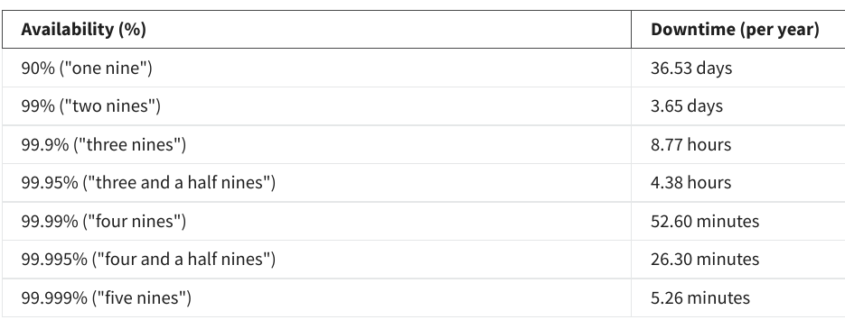
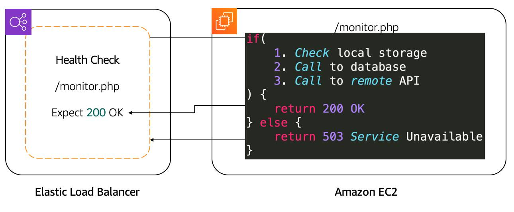
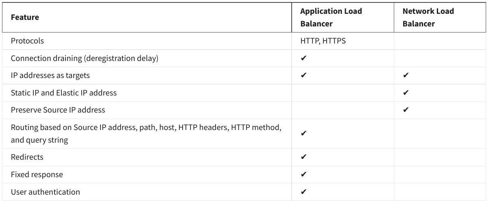
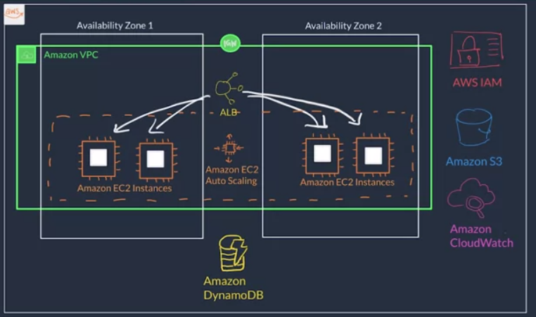
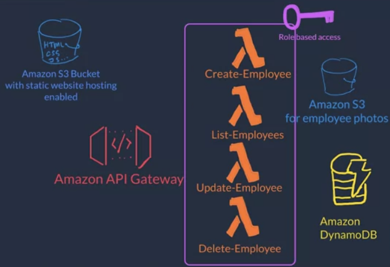
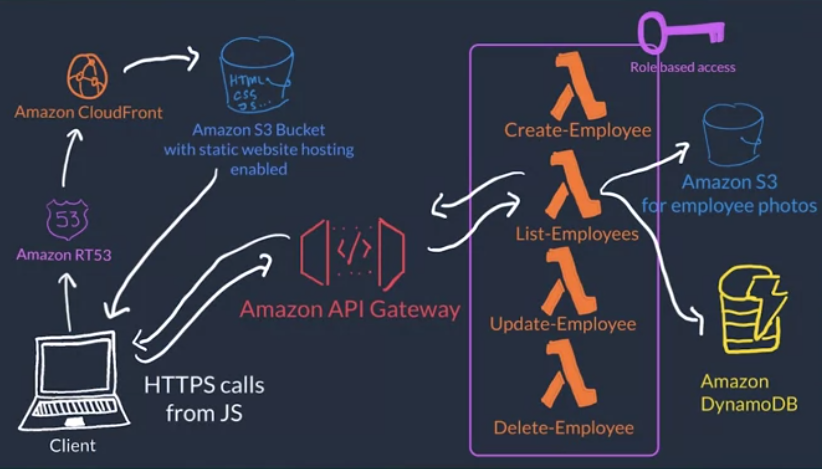

# Week 4

## Monitoring on AWS

Benefits of monitoring:

- Respond to poor metrics like request latency or error response rate proactively instead of waiting for user complaints
- Can highlight bottlenecks or inefficient / underutilized architectures
- Can derive a baseline and from that anomalous activity due to errors or security threads
- Monitoring data can help in making business decision (e.g. which storage type to choose)

Amazon CloudWatch...

- can collect logs/metrics from all Amazon services. In fact, most services send metrics already automatically sent data to it at a rate of 1 datapoint every 5 minutes for free (can be increased to every 1 minute using detailed monitoring).
- can create dashboards

## Optimization 

What availability means:

One way to increase availability is to replicate servers. If you do this, pay attention to...

- automating the update of configuration files, software, etc. - otherwise tiresome and error-prone manual work
- selecting either active-active setups (=both servers work simultaneously, desired) or active-passive setups (=one server is only as backup, necessary for stateful applications)
- redirecting requests to the servers automatically using a DNS-server or - even better - a load balancer, which distributes the load based on the health of each server.

### Elastic Load Balancing (ELB)

ELB...

- automatically scales up
- is a regional service and is thus replicated across availability zones
- is highly available
- can also work in hybrid mode, i.e. balances load to on-premise servers
- checks health of servers via API calls
- consists of three components
  - Listeners, which listens to client requests on defined ports and protocols. One ELB can have many listeners
  - Target **groups** = backend servers such as EC2 instances, AWS Lambda functions or IP addresses (health check needs to be defined for each group)
  - Rules, which associate listeners with target groups based on conditions.

There are three types of load balancers: 

- Application Load Balancer for HTTP, HTTPS protocols
- Network Load Balancer for TCP, TLS, UDP protocols
- Gateway Load Balancer for IP-addresses (useful for managing a fleet of third-party virtual applicances which support GENEVE ?)

### EC2 autoscaling

There are two types of scaling:

- vertical scaling = choose bigger size of server
  - necessary for stateful applications
- horizontal scaling = duplicate same server type
  - should be desired (?) and is supported by EC2 autoscaling

Setting up EC2 autoscaling requires three components

- Launch template = which resource should be generated
- EC2 auto scaling group = where shall additional resource be deploy
- Scaling policy = when shall resource be added / removed

EC2 autoscaling...

- support versioning
- can scale from minimum to maximum capacity. You can also define a desired capacity, which defines the number of instances upon group creation.
- supports different policies
  - simple scaling = trigger one new instance based on threshold (e.g. if CPU load > 60% in cloudwatch), then wait a bit to define next action
  - step scaling = trigger one or several instances depending on CPU load (e.g. 4 instances if CPU load at 95%)
  - target tracking policy = tracks target values (e.g. CUP utilization, request count) and sets up cloudwatch alarms automatically

### Exercise 7

- re-launch EC2 instance
- create a target group, i.e. a possible group of EC2-instances or IP-addresses whose health can be checked and to which you can register individual instances
- create load balancer, which publishes a single IP-address such as `http://load-balancer-687925759.eu-central-1.elb.amazonaws.com/` to route traffic to the previously defined target group
- create a launch template
- create an auto-scaling group (ASG), which...
  - spins up instances based on the previously defined launch template and registers them to the target group
  - sits between the previously defined load balancer and the previously defined target group (not sure whether this description is accurate, but at least we attach it to a load balancer. Alternatively, one could probably use a DNS service or simply reach the instances manually?)
  - Note: Given an autoscaling groups with min_instances=2, it will always spin up at least two instances, independent of the number of already existing instance in the target group (which have been created e.g. manually).
- During teardown
  - delete autoscaling first - otherwise new instances will be spun up if you manually stop existing ones
  - delete ec2 instances
  - delete dynamoDB and S3
  - delete subnets, routing table and VPC
  - delete roles

## Going Serverless

### Current architecture

The current architecture is an example of a three tier application consisting of 

- presentation layer = user interface (HTML, CSS, JS)
  - = frontend web server running on EC2 instance
- application layer = application / business logic
  - = backend logic for CRUD-ing the employee data hosted **also** on EC2 instance
- data layer = database

### Alternative architecture

An alternative serverless architecture could be designed as followed:

- Frontend to amazon S3. While it's dubbed a static website hosting, we can still dynamically pull data using JavaScript.
- Backend to amazon Lambda.
  - Apparently we don't want the frontend to connect to the backend directly (why?). Instead, expose the backend via an API using Amazon API Gateway.
  - Either one lambda function for all CRUD, or a separate one for each element
- Data layer stayes the same

You can use potentially more Amazon services like

- Amazon Route53 for domain name management of the website
- Amazon CloudFront to cache static assets closer to the end users using AWS edge locations

One advantages of the serverless architecture is less maintenance overhead / easier setup due to 

- no patching or AMI management
- no VPC, subnets, security group or network access control etc. (though it is possible to integrate a VPC for compliance regions)

### Container based

Also an option, but not described here.